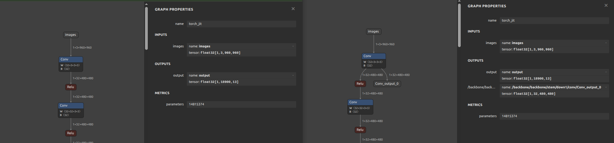

# ROS2 ONNX Feature Map Comparison

`onnxcomp` is a tool to compare feature maps with different inputs.

## Getting Started

### Build Python Environment

```shell
uv venv --python 3.10
uv sync
source .venv/bin/activate
```

### Update ONNX Models for Comparison

```shell
python3 tools/select_layer.py <ONNX_PATH>
```

You will be asked to select a layer name from the list of available layers:

```shell
# please fill by the layer name what you want to compare
Select layer name: <LAYER_NAME>
```

For example:

```shell
$ python tools/select_layer.py <ONNX_PATH>
>>> Show layers...
Layer 0:  Name=/backbone/backbone/stem/down1/conv/Conv, OpType=Conv, In=['images', 'onnx::Conv_1299', 'onnx::Conv_1300'], Out=['/backbone/backbone/stem/down1/conv/Conv_output_0']
Layer 1:  Name=/backbone/backbone/stem/down1/act/Relu, OpType=Relu, In=['/backbone/backbone/stem/down1/conv/Conv_output_0'], Out=['/backbone/backbone/stem/down1/act/Relu_output_0']
Layer 2:  Name=/backbone/backbone/stem/conv2/conv/Conv, OpType=Conv, In=['/backbone/backbone/stem/down1/act/Relu_output_0', 'onnx::Conv_1302', 'onnx::Conv_1303'], Out=['/backbone/backbone/stem/conv2/conv/Conv_output_0']
Layer 3:  Name=/backbone/backbone/stem/conv2/act/Relu, OpType=Relu, In=['/backbone/backbone/stem/conv2/conv/Conv_output_0'], Out=['/backbone/backbone/stem/conv2/act/Relu_output_0']
...
Select layer name: /backbone/backbone/stem/down1/conv/Conv
```

Then, The following two files will be created:

- `onnxcomp/data/<MODEL_NAME>_<LAYER_NAME>.onnx`
- `onnxcomp/config/<MODEL_NAME>_<LAYER_NAME>.param.yaml`

Here is the sample result (Left: Before, Right: After):


### Build ROS 2 Environment

```shell
rosdep update
rosdep install --from-paths . --ignore-src -r -y
colcon build --symlink-install
```

### Run ONNX Model on ROS 2
