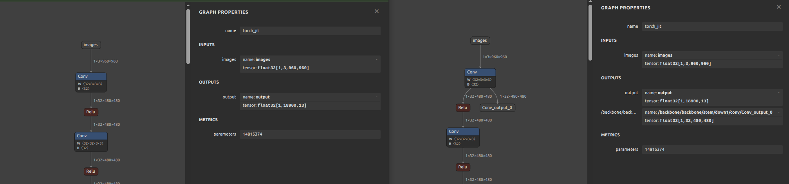

# ROS2 ONNX Feature Map Comparison

`onnxcomp` is a tool to compare feature maps with different inputs.

## Getting Started

### Build Python Environment

```shell
uv venv --python 3.10
uv sync
source .venv/bin/activate
```

### Update ONNX Models for Comparison

```shell
python3 -m tools.select_layer <ONNX_PATH>
```

You will be asked to select a layer name from the list of available layers:

```shell
# please fill by the layer name what you want to compare
Select layer name: <LAYER_NAME>
```

For example:

```shell
$ python3 -m tools.select_layer <ONNX_PATH>
>>> Show layers...
Layer 0:  Name=/backbone/backbone/stem/down1/conv/Conv, OpType=Conv, In=['images', 'onnx::Conv_1299', 'onnx::Conv_1300'], Out=['/backbone/backbone/stem/down1/conv/Conv_output_0']
Layer 1:  Name=/backbone/backbone/stem/down1/act/Relu, OpType=Relu, In=['/backbone/backbone/stem/down1/conv/Conv_output_0'], Out=['/backbone/backbone/stem/down1/act/Relu_output_0']
Layer 2:  Name=/backbone/backbone/stem/conv2/conv/Conv, OpType=Conv, In=['/backbone/backbone/stem/down1/act/Relu_output_0', 'onnx::Conv_1302', 'onnx::Conv_1303'], Out=['/backbone/backbone/stem/conv2/conv/Conv_output_0']
Layer 3:  Name=/backbone/backbone/stem/conv2/act/Relu, OpType=Relu, In=['/backbone/backbone/stem/conv2/conv/Conv_output_0'], Out=['/backbone/backbone/stem/conv2/act/Relu_output_0']
...
Select layer name: /backbone/backbone/stem/down1/conv/Conv
```

Then, The following two files will be created:

- `onnxcomp/data/<MODEL_NAME>_<LAYER_NAME>.onnx`
- `onnxcomp/config/<MODEL_NAME>_<LAYER_NAME>.param.yaml`

Here is the sample result (Left: Before, Right: After):


## Feature Comparison

### Run Comparison with T4 Datasets

- Compare 2 ONNX models' features for the same images:

  ```shell
  python3 -m tools.compare_2on1 <ONNX1> <ONNX2> <DATA_ROOT>
  ```

- Compare 2 ONNX models' features for images compressed with the different compression types or parameters:

  ```shell
  python3 -m tools.compare_2on2 <ONNX1> <ONNX2> <DATA_ROOT1> <DATA_ROOT2>
  ```

### Run Comparison on ROS 2

#### Build ROS 2 Environment

```shell
rosdep update
rosdep install --from-paths . --ignore-src -r -y
colcon build --symlink-install
source install/setup.bash
```

#### Compare 2 ONNX models' features for the same images:

```shell
ros2 launch onnxcomp compare_2on1.launch.xml onnx1:=<ONNX_PATH; str> onnx2:=<ONNX_PATH; str> input/image:=<IMAGE_TOPIC; str>
```

##### Input Topics

| Name            | Type                                   | Description                                        |
| --------------- | -------------------------------------- | -------------------------------------------------- |
| "~/input/image" | `sensor_msgs/Image \| CompressedImage` | Input image or compressed image if `use_raw=false` |

##### Output Topics

| Name                                       | Type               | Description                                                     |
| ------------------------------------------ | ------------------ | --------------------------------------------------------------- |
| "~/output/score/cosine_similarity"         | `std_msgs/Float64` | Output cosine similarity score between the two features         |
| "~/output/score/jensen_shannon_divergence" | `std_msgs/Float64` | Output Jensen-Shannon divergence score between the two features |

##### Parameters

| Name      | Type     | Default                | Description                       |
| --------- | -------- | ---------------------- | --------------------------------- |
| "onnx1"   | `string` | `"path/to/model.onnx"` | File path to the ONNX model       |
| "onnx2"   | `string` | `"path/to/model.onnx"` | File path to the ONNX model       |
| "use_raw" | `bool`   | `false`                | Whether to use raw image as input |

#### Compare 2 ONNX models' features for images compressed with the different compression types or parameters:

```shell
ros2 launch onnxcomp compare_2on2.launch.xml onnx1:=<ONNX_PATH; str> onnx2:=<ONNX_PATH; str> input/image1:=<IMAGE_TOPIC; str> input/image2:=<IMAGE_TOPIC; str>
```

##### Input Topics

| Name             | Type                                   | Description                                        |
| ---------------- | -------------------------------------- | -------------------------------------------------- |
| "~/input/image1" | `sensor_msgs/Image \| CompressedImage` | Input image or compressed image if `use_raw=false` |
| "~/input/image2" | `sensor_msgs/Image \| CompressedImage` | Input image or compressed image if `use_raw=false` |

##### Output Topics

| Name                                       | Type               | Description                                                     |
| ------------------------------------------ | ------------------ | --------------------------------------------------------------- |
| "~/output/score/cosine_similarity"         | `std_msgs/Float64` | Output cosine similarity score between the two features         |
| "~/output/score/jensen_shannon_divergence" | `std_msgs/Float64` | Output Jensen-Shannon divergence score between the two features |

##### Parameters

| Name      | Type     | Default                | Description                       |
| --------- | -------- | ---------------------- | --------------------------------- |
| "onnx1"   | `string` | `"path/to/model.onnx"` | File path to the ONNX model       |
| "onnx2"   | `string` | `"path/to/model.onnx"` | File path to the ONNX model       |
| "use_raw" | `bool`   | `false`                | Whether to use raw image as input |
